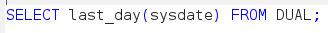
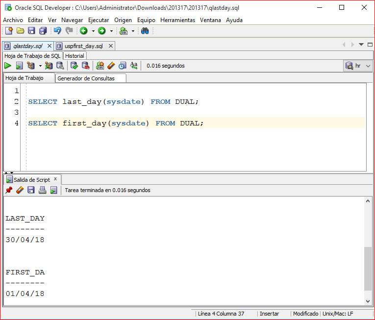

# Obtener el primer día del mes en curso con una función first_day() con PL/SQL en Oracle.

En PL/SQL existe la función <tt>LAST_DAY()</tt> con la que se obtiene el último día del mes en curso, entonces si tenemos que cumplir un requerimiento en donde necesitamos un campo o una variable con el último día del mes en curso simplemente ejecutamos esta función:

 

Ahora bien, si el requerimiento a cumplir se trata de obtener el primer día del mes en curso, no existe en PL/SQL Oracle una función predeterminada, por lo que para llegar a ese resultado basta con restarle un mes a la fecha en curso con la función <tt>ADD_MONTHS()</tt>, le aplicamos la función <tt>LAST_DAY()</tt> para obtener el último día del mes anterior y sumarle un día.

Siempre hay otra forma alterna de llegar al mismo resultado.

